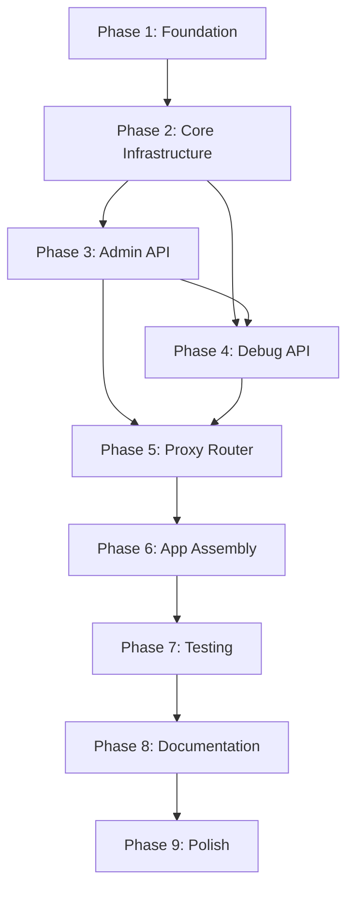

# LM Studio LAN Gateway - Implementation Plan

## Overview

This document outlines the phased implementation approach for building the production-ready LM Studio LAN Gateway. Each phase builds upon the previous one, with clear deliverables and testing requirements.

---

## Phase 1: Project Foundation & Setup ⚙️

**Objective**: Establish project structure, dependencies, and basic configuration

### Tasks
1. ✅ Create repository structure
2. ✅ Initialize Python package
3. ✅ Create requirements.txt with all dependencies
4. ✅ Create .env.example with all configuration variables
5. ✅ Create .gitignore for Python/FastAPI projects
6. ✅ Set up basic project files (pyproject.toml, README.md skeleton)

### Deliverables
- Complete directory structure (`src/lmstudio_gateway/`)
- `requirements.txt` with pinned versions
- `.env.example` with all environment variables
- `.gitignore` with Python/IDE exclusions
- Basic `README.md` with installation instructions

### Testing
- Verify virtual environment creation works
- Verify all dependencies install without conflicts
- Ensure project can be imported as a module

### Estimated Time: 30 minutes

---

## Phase 2: Core Infrastructure 🏗️

**Objective**: Implement settings, logging, middleware, and shared dependencies

### Tasks

#### 2.1 Settings Module (`settings.py`)
- ✅ Pydantic Settings class with all environment variables
- ✅ Validation for URLs, ports, log levels
- ✅ IP allowlist parsing helper
- ✅ Configuration singleton

#### 2.2 Logging Configuration (`logging_config.py`)
- ✅ Structured logging setup
- ✅ Multiple formatters (standard, access)
- ✅ Log level configuration from settings
- ✅ Logger configuration for uvicorn, app modules

#### 2.3 Middleware (`middleware.py`)
- ✅ IP allowlist middleware with CIDR support
- ✅ API key authentication middleware
- ✅ Proper error responses (401, 403)
- ✅ Health endpoint exemption logic

#### 2.4 Dependencies (`dependencies.py`)
- ✅ httpx AsyncClient lifecycle management
- ✅ LM Studio SDK client initialization
- ✅ Active model state management
- ✅ Debug state initialization
- ✅ Startup/shutdown event handlers

### Deliverables
- `src/lmstudio_gateway/settings.py` - fully functional
- `src/lmstudio_gateway/logging_config.py` - configured
- `src/lmstudio_gateway/middleware.py` - both middleware classes
- `src/lmstudio_gateway/dependencies.py` - all dependency functions

### Testing
- Unit tests for settings validation
- Unit tests for IP allowlist logic (CIDR, single IP, wildcard)
- Unit tests for API key middleware
- Integration tests for middleware chain

### Estimated Time: 2 hours

---

## Phase 3: Admin API (Model Management) 🎛️

**Objective**: Implement complete admin API for model operations

### Tasks

#### 3.1 Pydantic Models (`admin_models.py`)
- ✅ Request models: LoadModelRequest, UnloadModelRequest, ActivateModelRequest
- ✅ Response models: LoadModelResponse, UnloadModelResponse, ActivateModelResponse
- ✅ Nested models: LoadConfig, DefaultInference
- ✅ Validation rules and examples

#### 3.2 Admin Endpoints
- ✅ GET /admin/models - list available models
- ✅ POST /admin/models/load - load model with config
- ✅ POST /admin/models/unload - unload model
- ✅ POST /admin/models/activate - activate model

#### 3.3 LM Studio Integration
- ✅ Model loading via lmstudio-python SDK
- ✅ Load config support (context length, GPU, TTL)
- ✅ Instance management (multiple instances per model)
- ✅ Error handling for SDK operations

#### 3.4 State Management
- ✅ Active model tracking in app.state
- ✅ Model activation logic
- ✅ Default inference parameter storage

### Deliverables
- `src/lmstudio_gateway/admin_models.py` - complete admin router
- Functional model loading/unloading
- Active model state management

### Testing
- Unit tests for Pydantic models
- Integration tests for each endpoint
- Mock LM Studio SDK responses
- Test error cases (model not found, load failures)

### Estimated Time: 3 hours

---

## Phase 4: Debug API (Real-time Monitoring) 📊

**Objective**: Implement SSE-based debug API with real-time event streaming

### Tasks

#### 4.1 Debug State Models (`debug.py`)
- ✅ DebugState Pydantic model
- ✅ OperationInfo Pydantic model
- ✅ Event queue setup (asyncio.Queue)

#### 4.2 SSE Streaming Endpoint
- ✅ GET /debug/stream - Server-Sent Events
- ✅ Event generator with async queue
- ✅ Client disconnect detection
- ✅ Event broadcasting helper function

#### 4.3 Status & Metrics Endpoints
- ✅ GET /debug/status - current status snapshot
- ✅ GET /debug/metrics - performance metrics
- ✅ System metrics with psutil (CPU, RAM, GPU)
- ✅ Request history tracking

#### 4.4 Event Integration
- ✅ Integrate debug events into admin_models.py
- ✅ Model load progress events
- ✅ Inference progress events (prepare for Phase 5)
- ✅ Error event broadcasting

### Deliverables
- `src/lmstudio_gateway/debug.py` - complete debug router
- Real-time SSE streaming functional
- Status and metrics endpoints working
- Event broadcasting integrated into model loading

### Testing
- SSE client connection tests
- Event broadcasting tests
- Status endpoint accuracy tests
- Metrics endpoint with mock data
- Client disconnect handling

### Estimated Time: 3 hours

---

## Phase 5: Proxy Router (/v1/* endpoints) 🔄

**Objective**: Transparent proxy for OpenAI-compatible endpoints with monitoring

### Tasks

#### 5.1 Proxy Core (`proxy.py`)
- ✅ Dynamic route handler for /v1/{full_path:path}
- ✅ Support all HTTP methods (GET, POST, PUT, PATCH, DELETE)
- ✅ Header sanitization and forwarding
- ✅ Query parameter pass-through

#### 5.2 Request Processing
- ✅ JSON body parsing and patching
- ✅ Auto-inject active model if missing
- ✅ Auto-inject default inference params
- ✅ Content-Type detection

#### 5.3 Response Handling
- ✅ Status code pass-through
- ✅ Response header filtering
- ✅ Body forwarding (JSON and streaming)
- ✅ Error handling (502 for LM Studio errors)

#### 5.4 Inference Monitoring
- ✅ Broadcast inference_start events
- ✅ Track request timing
- ✅ Broadcast inference_complete events
- ✅ Update debug state during inference

### Deliverables
- `src/lmstudio_gateway/proxy.py` - complete proxy router
- Full /v1/* endpoint forwarding
- Model and parameter injection working
- Inference events integrated with debug API

### Testing
- Proxy endpoint tests (chat, completions)
- Model injection tests
- Parameter injection tests
- Error handling tests
- Streaming response tests

### Estimated Time: 2.5 hours

---

## Phase 6: Application Assembly & Health Check 🏁

**Objective**: Bring all components together in main FastAPI application

### Tasks

#### 6.1 Main Application (`main.py`)
- ✅ FastAPI app creation function
- ✅ CORS middleware configuration
- ✅ Security middleware registration (IP, API key)
- ✅ Router registration (admin, debug, proxy)
- ✅ Startup/shutdown event handlers

#### 6.2 Health Endpoint
- ✅ GET /health - basic health check
- ✅ Optional LM Studio connectivity check
- ✅ Auth exemption (configurable)

#### 6.3 __init__.py
- ✅ Package initialization
- ✅ Version export
- ✅ Main exports

### Deliverables
- `src/lmstudio_gateway/main.py` - complete application
- `src/lmstudio_gateway/__init__.py` - package init
- Fully functional FastAPI application
- All endpoints accessible and working

### Testing
- End-to-end integration tests
- Health endpoint tests
- Middleware chain verification
- Full request flow tests (client → gateway → LM Studio)

### Estimated Time: 1.5 hours

---

## Phase 7: Testing Suite 🧪

**Objective**: Comprehensive test coverage across all modules

### Tasks

#### 7.1 Test Infrastructure
- ✅ pytest configuration (pytest.ini or pyproject.toml)
- ✅ Test fixtures (mock LM Studio, test app, test client)
- ✅ Async test helpers
- ✅ Mock factories

#### 7.2 Unit Tests
- ✅ Settings validation tests
- ✅ Middleware logic tests
- ✅ Pydantic model validation tests
- ✅ Helper function tests

#### 7.3 Integration Tests
- ✅ Admin API endpoint tests
- ✅ Debug API endpoint tests (including SSE)
- ✅ Proxy endpoint tests
- ✅ Authentication flow tests

#### 7.4 Coverage
- ✅ Run coverage reports
- ✅ Achieve 80%+ coverage
- ✅ Critical path coverage 95%+

### Deliverables
- `tests/unit/` - complete unit test suite
- `tests/integration/` - complete integration tests
- `tests/fixtures/` - reusable test fixtures
- `pytest.ini` or test configuration in pyproject.toml
- Coverage report (HTML)

### Testing
- All tests pass
- Coverage meets targets
- No flaky tests

### Estimated Time: 3 hours

---

## Phase 8: Documentation & Deployment 📚

**Objective**: Complete documentation and deployment configurations

### Tasks

#### 8.1 README.md
- ✅ Project overview and features
- ✅ Installation instructions (pip, venv)
- ✅ Configuration guide (.env variables)
- ✅ Quick start guide
- ✅ API endpoint documentation
- ✅ Usage examples
- ✅ Troubleshooting section

#### 8.2 Docker Setup
- ✅ Dockerfile (production-ready)
- ✅ docker-compose.yml
- ✅ .dockerignore
- ✅ Multi-stage build (optional optimization)

#### 8.3 Additional Docs
- ✅ API reference (or link to /docs)
- ✅ Architecture diagram (optional)
- ✅ Contributing guidelines
- ✅ License file

#### 8.4 Development Tools
- ✅ pyproject.toml (package metadata)
- ✅ Black configuration
- ✅ Ruff configuration
- ✅ mypy configuration

### Deliverables
- Complete README.md
- Dockerfile and docker-compose.yml
- Development tool configurations
- Additional documentation files

### Testing
- Docker build succeeds
- Docker container runs successfully
- Documentation is clear and accurate

### Estimated Time: 2 hours

---

## Phase 9: Polish & Production Readiness ✨

**Objective**: Final refinements, optimizations, and production checks

### Tasks

#### 9.1 Code Quality
- ✅ Run Black formatter on all code
- ✅ Run Ruff linter and fix issues
- ✅ Run mypy type checker and fix issues
- ✅ Code review and refactoring

#### 9.2 Performance
- ✅ Profile key endpoints
- ✅ Optimize slow paths if needed
- ✅ Memory leak checks
- ✅ Load testing (optional)

#### 9.3 Security Review
- ✅ Dependency security audit (pip-audit)
- ✅ Input validation verification
- ✅ Secret management review
- ✅ CORS configuration review

#### 9.4 Final Testing
- ✅ End-to-end manual testing
- ✅ Test with actual LM Studio instance
- ✅ Test from multiple LAN clients
- ✅ Verify all features work as documented

### Deliverables
- Production-ready codebase
- All quality checks passing
- Security audit complete
- Performance benchmarks

### Testing
- Full manual test pass
- All automated tests passing
- Security scan clean

### Estimated Time: 2 hours

---

## Total Estimated Time: 19.5 hours

---

## Implementation Order & Dependencies

---

## Success Criteria

### Per Phase
- [ ] All tasks completed
- [ ] All tests passing
- [ ] Code follows style guidelines
- [ ] Documentation updated

### Overall Project
- [ ] All API endpoints functional
- [ ] Test coverage ≥ 80%
- [ ] Security best practices implemented
- [ ] Docker deployment working
- [ ] Documentation complete and accurate
- [ ] Successfully tested with real LM Studio instance

---

## Risk Mitigation

### Potential Risks
1. **LM Studio SDK issues**: Mock SDK during development, test with real SDK in Phase 9
2. **SSE complexity**: Use proven sse-starlette library, test thoroughly in Phase 4
3. **Performance bottlenecks**: Profile early, optimize in Phase 9
4. **Authentication issues**: Test middleware extensively in Phase 2

### Mitigation Strategies
- Write tests before implementation (TDD where appropriate)
- Use proven libraries (FastAPI, Pydantic, sse-starlette)
- Regular integration testing at phase boundaries
- Early testing with actual LM Studio instance

---

## Notes for AI Assistants

1. **Follow CLAUDE.md**: All implementation must follow patterns in CLAUDE.md
2. **Test-driven**: Write tests alongside or before implementation
3. **Type hints**: All functions must have proper type hints
4. **Error handling**: Comprehensive error handling at every layer
5. **Logging**: Log important events with appropriate levels
6. **Security**: Never skip authentication/validation checks
7. **Documentation**: Update inline docs as you code

---

**Ready to begin implementation?** Start with Phase 1! 🚀
